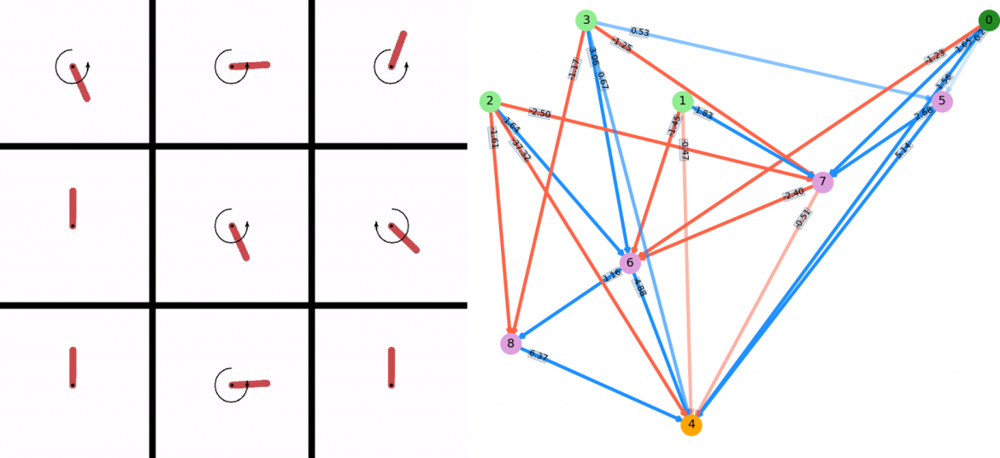

Experiments with playing OpenAI games with NEAT
==========================================

  

Overview
--------------------------------

This project uses Kenneth Stanley's popular [NEAT framework](https://en.wikipedia.org/wiki/Neuroevolution_of_augmenting_topologies) to evolve neural networks to play OpenAI gym games. `Node` objects are the basic unit of `EPANN` objects, a collection of which forms the `Population` object. Tests to compare different population parameters can be done with `PopTests.py`.

Main scripts
-------------------------------

These are the scripts I run, that use the classes described below. They live in the main dir. A brief description:

* `ev1.py` - Creates a `Population` object for a given class and evolves the population.
* `ablation_test.py` - Takes a fully formed network and repeatedly removes a connection and then evaluates the FF of that network, starting from the smallest connection weight up, to find the critical ones.
* `movie_combine.py` - Combines several movie files into a single movie file in a grid format.
* `createEnvJson.py` - Writes a dict of info about the gym envs (or other envs) to use for labels, etc

Classes
--------------------------------

* `Node.py` - The basic unit of the network. Can be set to be an input, output, or bias node.
* `EPANN.py` - The network. It starts from just input, bias, and output nodes. The number of I/O nodes are based on the number of inputs/outputs of the agent class being simulated. Nodes and connections are then added and removed via mutations. It is also responsible for running an episode of the agent class to evaluate the FF.
* `Population.py` - This creates a population of `EPANN` objects and repeatedly evaluates their FF's, sorts them via their FF's, and then keeps and mutates the best of the population. This is all done via its `evolve()` function.
* `PopTests.py` - This does several evolutions of different `Population` objects, with different parameters, to compare how different population parameters (trading off `N_gen` vs `N_pop` for example) affects evolution.
* `GymAgent.py` - This is a generic wrapper class for `gym` agents.
* `FileSystemTools.py` - Just a little list of custom functions that I found myself using often, mostly string formatting type stuff.

#
